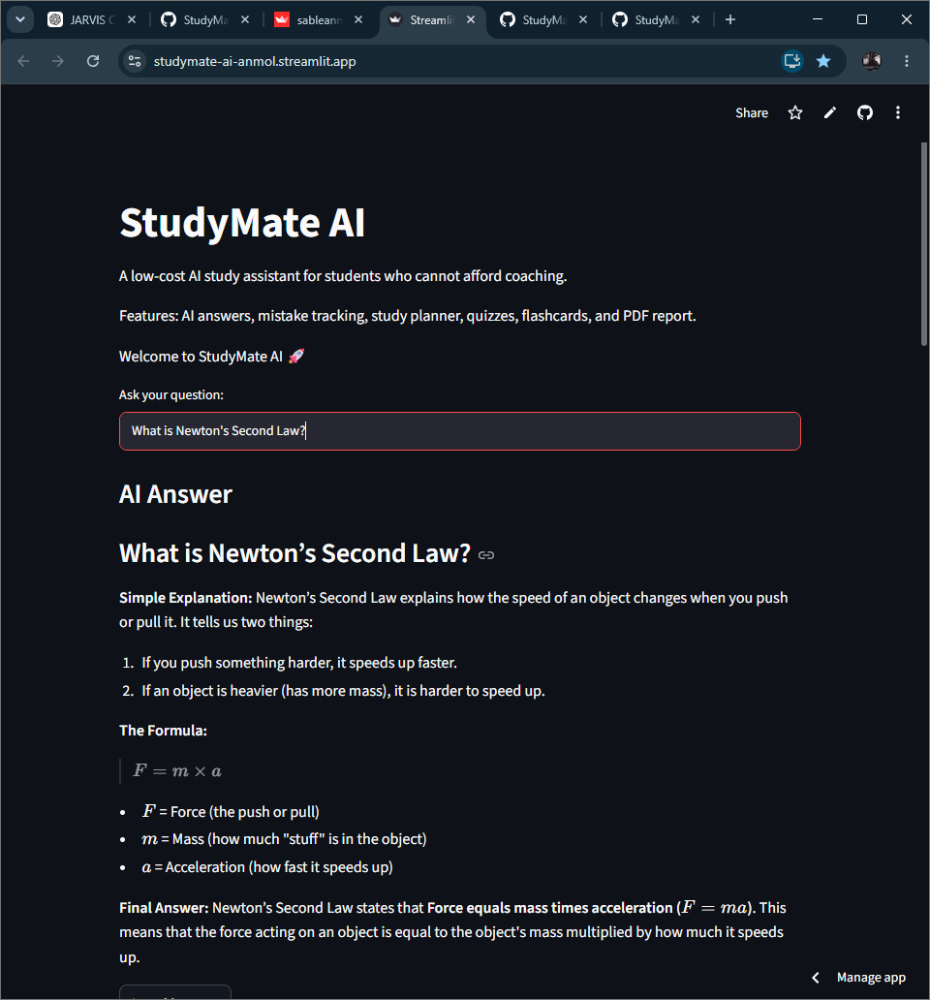
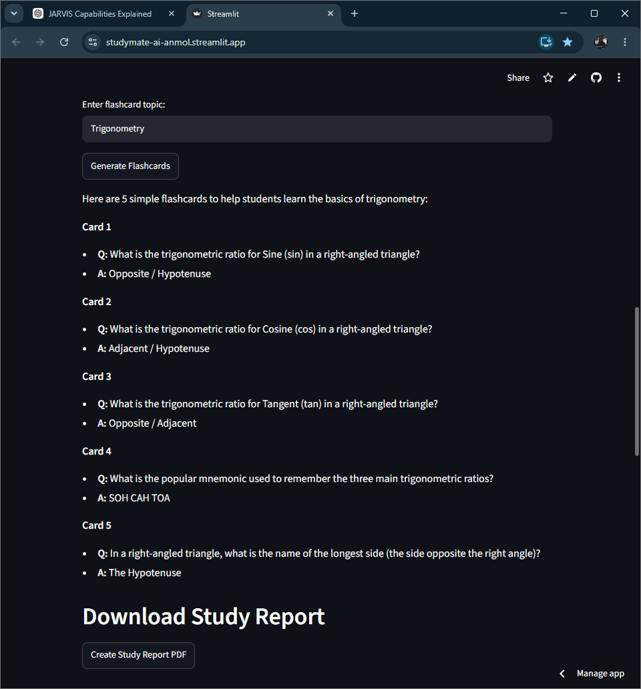
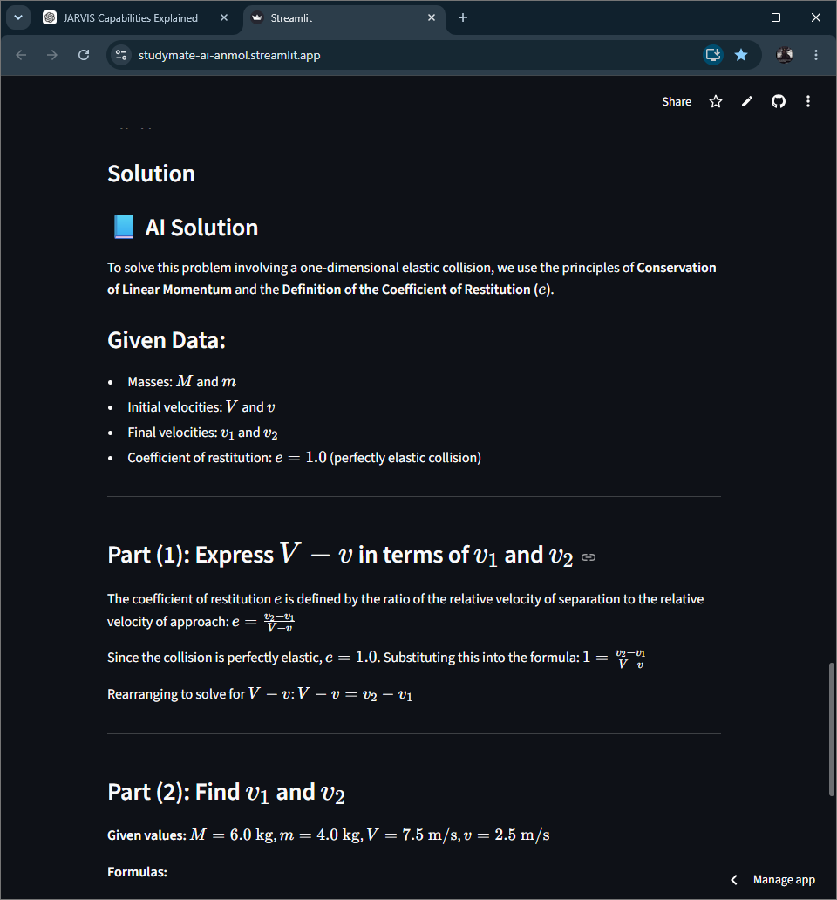

# StudyMate AI

StudyMate AI is an AI-powered educational platform developed using Python, Streamlit, and Google's Gemini API. It helps students learn more effectively through personalized study tools, AI-generated explanations, quizzes, flashcards, progress tracking, and study planning.

## Features

* AI Question Answering
* AI Flashcard Generator
* AI Quiz Generator
* Personalized Study Planner
* Mistake Tracking
* Progress Analytics Dashboard
* PDF Study Report Export
* Image-Based Question Solving
* MEXT/KOSEN Practice Question Generation

## Technologies Used

* Python
* Streamlit
* Google Gemini API
* Pandas
* Matplotlib
* ReportLab
* Pillow (PIL)

## Purpose

The project was designed to make learning more accessible and efficient by providing students with AI-powered academic support, practice materials, progress monitoring, and personalized study resources.

## Screenshots

### AI Question Answering

### Flashcard Generator

### MEXT/KOSEN Question Generator

### Image Question Solver

## Author

Anmol Sable

Last updated: June 2026
